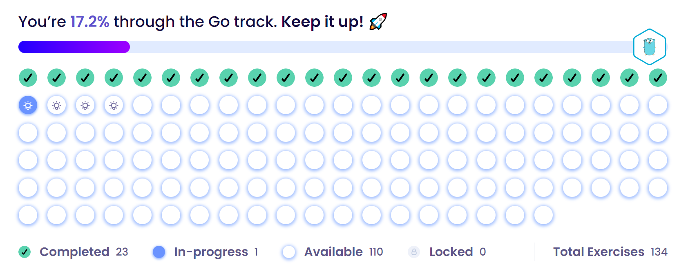

# GO
Creating a go lang practice repository to learn and explore go capabilities.

# Following a site that allows me to develop my knowledge `https://exercism.org/tracks/go`

# Basics 
From the start we have to download go.mod to our local repo to compile a file in a folder with command like this : `go  mod init github.com/eska5/basicStart`
It will install go.mod in our directory and we will be able to compile our GO files.

Before we begin we have to know a few of commands:
1. `go run .\main.go` will compile and run the file.
2. `go build .\main.go` will build `main.exe` executable file.
3. `.\main.exe` will run executable file.

# Go Path Updated Daily

